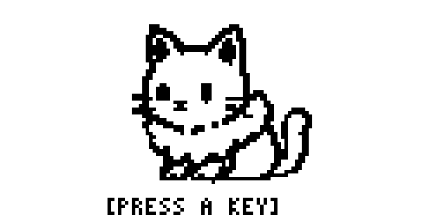
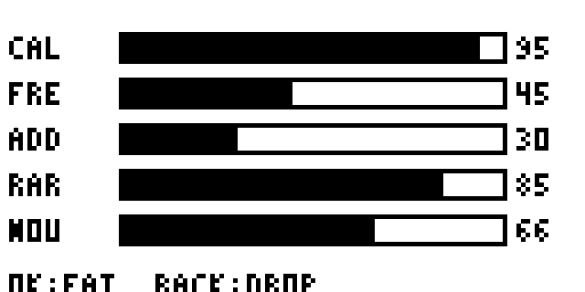
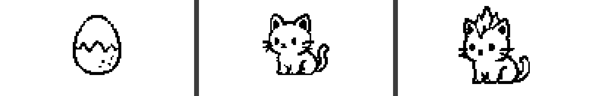
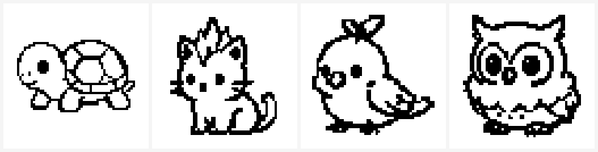

# Radiotchi 📻🐣

> A Tamagotchi-style virtual pet for the **Flipper Zero** that you feed with **real Sub‑GHz radio signals** from the world around you.

<p align="center">
  
</p>

Carry your Flipper outside, **Feed** it, and it sweeps the Sub‑GHz bands, grabs the strongest signal it can hear, and analyses *what that signal actually was*. Every catch is scored on a five‑axis **nutrition label**, and the analysed content shapes how your creature grows — so your pet becomes a living reflection of your personal radio environment. Each catch is also logged in a **dex** that doubles as a personal RF field guide.

It cares about **what** you caught, not merely **that** you used the radio.

> **RX‑only.** Radiotchi only ever *listens*. It never transmits, replays, or jams anything.

---

## ✨ What it does

- **Feed on real RF.** A sweep over Japan‑relevant Sub‑GHz bands locks the single strongest signal and captures it losslessly (raw `.sub` + analysis).
- **A five‑axis nutrition label.** Every catch is scored — **Calories** (data volume), **Freshness** (signal strength), **Additives** (entropy: high = encrypted/junk), **Rarity** (how unusual it is *for you*), **Nourishment** (how deeply it could be decoded).

  

- **A creature shaped by your diet.** 5 stats are long‑memory averages of what you feed it; at level checkpoints the pet morphs into one of **100 character types**. Junk keeps it scrappy; rare, structured, decodable signals grow something special — and it’s **reversible**, so a change of diet re‑shapes it over time.

  

- **A dex / RF field guide.** Browse the species you’ve collected and, for protocols the firmware can decode, how many **distinct devices** of each kind you’ve seen — privacy‑safe (a one‑way tag, never the raw identifier).
- **Honest decoding.** Known protocols are decoded by the firmware’s own Sub‑GHz decoders; clean fixed‑codes are demodulated directly; everything else still gets a full label, and ambient noise is correctly rejected.

<p align="center">
  
</p>

---

## 🚀 Install

1. Grab `radiotchi.fap` from the [**Releases**](../../releases) page.
2. Copy it onto your Flipper at `SD Card / apps / Sub‑GHz / radiotchi.fap` (via [qFlipper](https://flipperzero.one/update) or drag‑and‑drop).
3. On the Flipper: **Apps → Sub‑GHz → Radiotchi**.

Built for Flipper Zero **OFW** (and OFW‑compatible firmwares). RX‑only — no special firmware needed.

## 🎮 How to play

- On the home screen, **press any key** to open the command menu.
- **Feed** — sweep the bands and catch the strongest signal, read its label, then **Eat** to grow your pet.
- **Detail** — your pet’s name, level, type, and stats.
- **Dex** — browse what you’ve collected.
- **Re‑grade** — re‑analyse your whole history when decoding improves (old catches gain meaning retroactively).
- **Tune** — adjust the detection threshold/margin.

The full walkthrough is in the **[User Manual](docs/USER_MANUAL.md)**.

## 🔒 Privacy & ethics

- **RX‑only**, always. No transmit, replay, jamming, or interfering with anyone’s systems.
- The dex stays **on your device**. Persistent identifiers (e.g. TPMS / key‑fob serials) are **never surfaced raw** — only as one‑way hashed, family‑level tags — so it can’t be used to track a vehicle or person.

## 🛠️ Build from source

```sh
pip install ufbt
ufbt update          # fetch the Flipper SDK (one-time)
ufbt                 # build dist/radiotchi.fap
ufbt launch          # build + upload + run on a connected Flipper
```

Run the host unit tests (pure C, libm‑free, no hardware needed):

```sh
make -C test
```

More in **[docs/dev-setup.md](docs/dev-setup.md)**.

## 📚 Project docs

Radiotchi is a **learning‑first** project — descending into low‑level RF through play — so the design is documented in depth:

- [Project overview](docs/project-overview.md) · [Product spec](docs/product-spec.md) — what it is and why.
- [Architecture](docs/architecture.md) · [Data model](docs/data-model.md) — the three layers and the schema.
- [Pet growth spec](docs/pet-growth-spec.md) · [UI spec](docs/ui-spec.md) — the morph system and the screens.
- [Decision log](docs/decision-log.md) — every locked decision and *why* (the project’s story).
- [Testing strategy](docs/testing-strategy.md) · [Open questions](docs/open-questions.md).
- **[Full docs index →](docs/README.md)**

## 🧩 How it works (in one breath)

A portable, host‑testable **Analysis Core** (`lib/analysis_core/`, pure C) turns a raw capture into a scored event; a **Capture Source** adapter drives the CC1101 and the firmware’s protocol decoders; the **Game Shell** runs the pet, the dex, and the UI. Only two typed records cross the layer boundaries, which keeps the hard RF logic deterministic and unit‑tested off‑device.

## 📄 License

MIT — see [LICENSE](LICENSE).

---

*Radiotchi is a hobby/learning project, not a security tool. Use it to learn how the airwaves around you actually work.*
